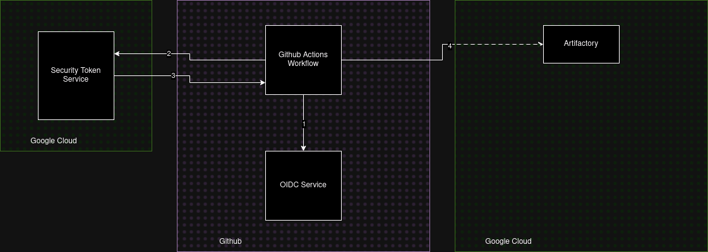

# Cloud IAM Permissions Assignment

## Overview
In this assignment, you will gain hands-on experience with Google Cloud Platform (GCP) and GitHub Actions by setting up a fully functional CI/CD pipeline to build and deploy Docker images to a Google Cloud Artifact Registry. You will also configure Workload Identity Federation to securely authenticate your GitHub Actions workflows with GCP without needing long-lived service account keys. This approach is essential for modern cloud-based CI/CD pipelines, ensuring secure and scalable authentication.

By the end of this assignment, you will:
- Understand how to create and configure an Artifact Registry in GCP.
- Implement Workload Identity Federation for secure access between GitHub and GCP.
- Configure IAM roles and permissions to control access to cloud resources.
- Automate Docker image builds and pushes using GitHub Actions.

- 

The `Workload Identity Pool` has direct IAM permissions on a Google Cloud Artifactory repository. You will be responsible for creating both the Artifactory and the binding permissions on behalf of the Workload Identity. This method of access GCP resources from Github is preferred since it directly authenticates GitHub Actions to Google Cloud without a proxy resource. 

You will be graded on the following:
1. **Working Github Action Workflow**: Create a CI workflow that will build and push an image to gcr.io Container Repository
2. **Configure Direct Workload Identity Federation**: Create Workload Identity Pool that has IAM permissions to GCP Artifactory
3. **Create an Artifact Repository**: Create GCP Artifact Repository for our image
4. **IAM Permissions**: Configuring Workload Identity Federation for GitHub Actions authentication and authorize access to GCP Artifactory.

## Rubric

| **Criteria**                               | **Description**                                                                              | **Points** |
|--------------------------------------------|----------------------------------------------------------------------------------------------|------------|
| **Working GitHub Action Workflow**         | The GitHub Action should successfully build a Docker image and push it to the Artifact Registry without errors. Ensure the correct region and repository are used. | 2 pt       |
| **OIDC Workload Federation Identity**      | Configure OIDC Workload Identity Federation to authenticate GitHub Actions with GCP, ensuring the correct IAM roles are assigned to the identity pool. A complete solution will use GCP service accounts and the GitHub OIDC provider without using long-lived credentials. | 5 pt       |
| **Create Artifact Registry**               | The Artifact Registry must be created in GCP using the correct repository format (docker) and in the specified region.          | 3 pt       |
| **Grant Permissions to OIDC PrincipalSet** | Grant the necessary IAM roles to the Workload Identity Federation principal, allowing the GitHub Actions workflow to push Docker images to the Artifact Registry. Correct permission setup will be verified by pushing images to the registry. | 5 pt       |

## Prerequisites
- **GCP account**: You must have a valid Google Cloud Platform account with billing enabled.
- **Public GitHub repository**: Ensure you have a public GitHub repository, as GitHub Actions will need access to the workflow runners for this project.
- **Basic knowledge of Containers**: Familiarity with Docker containers, building images, and pushing them to registries.
- **Familiarity with IAM and cloud security principles**: This assignment involves configuring permissions and security settings for your GCP resources.

## Resources
- [Direct Workload Identity Federation](https://github.com/google-github-actions/auth?tab=readme-ov-file#preferred-direct-workload-identity-federation) - This documentation explains how to set up Workload Identity Federation for GitHub Actions. Focus on `(Preferred) Direct Workload Identity Federation` section.
- [Create Docker Artifactory](https://cloud.google.com/artifact-registry/docs/repositories/create-repos#create-repo-gcloud-docker) - Follow this guide to create a Docker Artifact Registry in GCP. Pay attention to the gcloud commands for creating the repository.
  - **Please omit the --kms-key and --immutable-tags --async** flags
  - ` gcloud artifacts repositories create YOUR_REPOSITORY_NAME --repository-format=docker --location=[REGION] --description="some description" --project=[PROJECT ID]`
- [Artifactory Access Control](https://cloud.google.com/artifact-registry/docs/access-control) - This guide covers how to configure IAM permissions for your Artifact Registry. Ensure you understand how to grant roles to your Workload Identity Pool.
- [Github Action](https://docs.github.com/en/actions/writing-workflows/quickstart) - This quickstart guide will help you set up your first GitHub Action workflow.
  - Please note that the [ci.yaml](.github/workflows/ci.yml) has a "working" solution commented out. You job is to enable the workflow with proper IAM permissions

## Submission
You will submit your GitHub project link to Canvas. Ensure that the following are included in your repository:

- **logging.json**: Exported logs of GCP activity (from the Logging service in GCP). This will show the actions performed during the creation of the registry and the setup of Workload Identity Federation.
- **metrics.csv**: Exported metrics data from Workload Identity Pools (found under IAM > Workload Identity Federation > ellipsis on graph > "View In Metrics Explorer" > Download). This will provide insight into authentication metrics for your workload identity.

You must have all your files merged to `main`. 

## Helpful commands

### List Artifact Repositories
Use this command to list all Artifact Registries in your GCP project. Replace [PROJECT ID] and [REGION] with your specific values.

```shell
 gcloud artifacts repositories list --project=[PROJECT ID] --location=[REGION]
```

### Verify Permissions on Artifact Registry
This command checks the IAM policy for your Artifact Registry. Ensure your Workload Identity Pool has the correct permissions to push Docker images.

```shell
gcloud artifacts repositories get-iam-policy dansc0de \
  --location=us-central1 \
  --project="${PROJECT_ID}"
```

